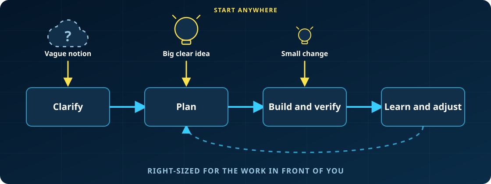

**Turn an idea or change request into working software without giving up the thinking.**

**Heard BMad means heavyweight process for every change? It doesn't.** Small changes go straight to build. Complex work gets the depth it needs.



_Start anywhere. Use BMad end to end, or carry its briefs, specifications, and architecture into your existing delivery workflow._

## Start Building

**Prerequisites:** [Node.js](https://nodejs.org) 20.12+, [Python](https://www.python.org) 3.10+, and [uv](https://docs.astral.sh/uv/)

```bash
npx bmad-method install
```

Open your project in your AI coding tool, invoke `bmad-build` with what you want to change, and keep making the decisions that matter. Run `bmad-help` whenever you want guidance on what comes next or what is optional.

**[Build your first project with BMad →](https://docs.bmad-method.org/tutorials/getting-started/)**

BMad is free and open source, with no paywalled workflows or gated community. For prerelease builds, CI/CD, configuration overrides, and non-interactive setup, see the [installation guide](https://docs.bmad-method.org/how-to/install-bmad/).

## Why BMad?

Coding assistants are effective at implementation, but they often turn unstated assumptions into code. BMad keeps you in control while its agents and workflows make the important decisions explicit and preserve them as context for the work that follows.

- **Right-sized process** — Go directly to implementation for clear changes or add deeper planning for larger initiatives.
- **Durable context** — Carry product and technical decisions forward instead of re-explaining them in every chat.
- **Specialized perspectives** — Bring in product, architecture, UX, development, and testing expertise when it helps.
- **Guided collaboration** — Use structured workflows and multiple-agent discussions without handing over judgment.
- **One delivery path** — Move from early thinking through reviewed implementation, correction, and learning.

[See how the workflows fit together →](https://docs.bmad-method.org/reference/workflow-map/)

## BMad Ecosystem

Install the core method or add official modules for specialized work.

| Module | Purpose |
| --- | --- |
| **[BMad Method (BMM)](https://github.com/bmad-code-org/BMAD-METHOD)** | Plan and deliver software with scale-adaptive workflows |
| **[BMad Builder (BMB)](https://github.com/bmad-code-org/bmad-builder)** | Create custom BMad agents and workflows |
| **[Test Architect (TEA)](https://github.com/bmad-code-org/bmad-method-test-architecture-enterprise)** | Design risk-based test strategy and automation |
| **[Game Dev Studio (BMGD)](https://github.com/bmad-code-org/bmad-module-game-dev-studio)** | Build games with Unity, Unreal, or Godot workflows |
| **[Creative Intelligence Suite (CIS)](https://github.com/bmad-code-org/bmad-module-creative-intelligence-suite)** | Run innovation, brainstorming, and design-thinking workflows |

## Plan on the Web

[Web bundles](https://bmadcode.com/web-bundles/) package selected BMad workflows as Google Gemini Gems and ChatGPT Custom GPTs. Use them for planning in your existing web subscription, then bring the resulting artifacts into your AI coding tool for implementation.

## Documentation

- **[Getting Started](https://docs.bmad-method.org/tutorials/getting-started/)** — Install BMad and build a small project.
- **[Workflow Map](https://docs.bmad-method.org/reference/workflow-map/)** — Understand the available paths and outputs.
- **[Established Projects](https://docs.bmad-method.org/how-to/established-projects/)** — Add BMad to an existing codebase.
- **[Upgrade to V6](https://docs.bmad-method.org/how-to/upgrade-to-v6/)** — Migrate from an earlier version.

## Roadmap

See what is in progress and what is planned on the [public roadmap](https://docs.bmad-method.org/roadmap/).

## Community

- [Discord](https://discord.gg/gk8jAdXWmj) — Get help, share ideas, and collaborate.
- [YouTube](https://youtube.com/@BMadCode) — Watch tutorials and master classes.
- [GitHub Issues](https://github.com/bmad-code-org/BMAD-METHOD/issues) — Report bugs and request features.
- [GitHub Discussions](https://github.com/bmad-code-org/BMAD-METHOD/discussions) — Join longer community conversations.
- [BMad Code](https://bmadcode.com) — Explore the wider ecosystem.

## Support and Contributing

BMad is free for everyone and always will be. Star the repository, [buy me a coffee](https://buymeacoffee.com/bmad), or email <contact@bmadcode.com> for corporate sponsorship.

Contributions are welcome. Read [CONTRIBUTING.md](CONTRIBUTING.md) before opening a pull request.

## License

MIT License — see [LICENSE](LICENSE) for details.

**BMad** and **BMAD-METHOD** are trademarks of BMad Code, LLC. See [TRADEMARK.md](TRADEMARK.md) for details.

[](https://github.com/bmad-code-org/BMAD-METHOD/graphs/contributors)

See [CONTRIBUTORS.md](CONTRIBUTORS.md) for contributor information.

[](https://www.npmjs.com/package/bmad-method)
[](LICENSE)
[](https://discord.gg/gk8jAdXWmj)
